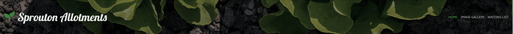
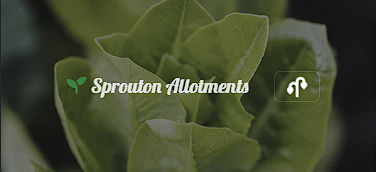

## Table of Contents
* [Purpose](#Purpose)
* [User Experience Design (UX)](#User-Experience-Design)
  * [User stories](#User-Stories)
    * [First Time Visitor Goals](#First-Time-Visitor-Goals)
    * [Returning Visitor Goals](#Returning-Visitor-Goals)
    * [Frequent User Goals](#Frequent-Visitor-Goals)
  * [Structure](#Structure)
  * [Design](#Design)
    * [Colour Scheme](#Colour-Scheme)
    * [Typography](#Typography)
    * [Imagery](#Imagery)
    * [Wireframes](#Wireframes)
    * [Differences to Design](Differences-to-Design)
* [Limitations](#Limitations)
- [Features](#Features)
    * [Existing Features](#Existing-Features)
    * [Future Features](#Features-Left-to-Implement)
* [Technologies](#Technologies)
* [Testing](#Testing)
    * [Test Strategy](#Test-Strategy)
      * [Summary](#Summary)
      * [High Level Test Cases](#High-Level-Test-Cases)
      * [Out of Scope](#Out-of-Scope)
    * [Test Results](#Test-Results)
    * [Testing Issues](#Issues-and-Resolutions-to-issues-found-during-testing)
* [Deployment](#Deployment)
    * [Project Creation](#Project-Creation)
    * [GitHub Pages](#Using-Github-Pages)
    * [Locally](Run-Locally)
* [Credits](#Credits)
  * [Content](#Content)
  * [Media](#Media)

# Milestone Project One
## Purpose
This website was created for the required Milestone Project One for the Code Institutes Web Development Course.

The live website can be found [here](https://graea85.github.io/Sprouton-Allotments/index.html)

I wanted to build a website to showcase a fictional allotment site, based in England. The website is designed to inform users about what is involved in owning an allotment, what a typical allotment site is like and guides on how to get started. The information and images present on the pages are designed in a way to make the website feel real. 
The website is built using my own knowledge gained throughout the course of HTML and CSS, taking into account UX design at every step.

## Project Research 

Having recently acquired my own allotment and researching the topic, I have presented the information in such a way that is ideal for beginners and undaunting like some allotment websites tend to be. The knowledge is what I wish I had prior to having my own allotmment.

  * Research Analysis
  
  There has been a massive increase of interest in allotment ownership, particularly through the pandemic. Waiting lists are a big thing for all allotment sites so encouraging people to sign up as early as possible will benefit them greatly as some waiting lists can be up to 10 years +

# Sprouton Allotments

Sprouton Allotments are a community run allotment site for veteran and beginner allotmenteers to create, grow and showcase their garden and allotment sites. The website is targeted at existing Sprouton Allotment owners to keep up to date with allotment developments, as well as budding gardeners hoping to get their hands dirty and jump into an allotment of their own. The website is designed to inform people about the allotment site, what can be done with an allotment and place themselves on a waiting list for an allotment in the future. 

## User Experience Design

### User stories

#### First Time Visitor Goals

 - As a First Time user, I want to easily understand the main purpose of the site and learn more about the allotment site and allotment ownership.
- As a First Time user, I want to be able to navigate throughout the site pages to find relevant content.
- As a First Time user, I want to view the website and content clearly on the device I am currently using and switch between devices and have the webpage be responsive.
- As a First Time user, I want to find out about the allotment site, how to get an allotment and some beginner tips.

### Returning Visitor Goals

- As a Returning user, I want to apply for an allotment, if I haven't already.
- As a Returning user, I want to contact the allotment owners to ask any questions I might have
- As a returning user, I want to get a list of the equipment that I need and see what is avaiable to buy in the allotment shop.

### Frequent Visitor Goals

- As a Frequent user, I want to check to see if there are any upcoming changes to the allotment site.
- As a Frequent user, I want to check what stock the allotment shop has or contact the allotment shop for them to order an item in for me.
- As a Frequent user, I want to view the image gallery to see if my allotment is being showcased.

## Structure

## Existing Features 

- __Navigation Bar__

 

  - The navigation bar is present across all three pages of the Sprouton Allotment website. It is fully responsive and includes links to the home page, image gallery and the allotment application page. The navigation bar is in a fixed position therefore always visible to the user when scrolling the page. This is effective UX design, preventing the user to have to scroll back to the top of the page manually, or rely on auto-scoll buttons placed on the website.
  
  The navigation bar shrinks to a "hamburger" icon and presents the links in a drop-down menu when the website is viewed on smaller screens such as a mobile phone or smaller tablet. I have changed the default hamburger icon to a plant related font awesome icon, in-keeping with the page design. This may be against UX design as users are familiar with the default hamburger icon. This was confirmed in user testing, however to add interactivity to the website I decided to keep the icon and make it "bounce" so users will be attracted to click it. The bouncing animation stops once the button is pressed.

  The current page is highlighted in green to notify the user of their current page and links change colour upon hover to notify the user the link is clickable.

  The background image of the navigation bar is responsive and changes to a different image on smaller screens - this is for aesthetic reasons. I have applied a filter to the background image which allows for the links to easily stand out against the background and give the navigation bar a more professional look.

  > As a first time user its important that I can navigate through the entire website easily - If I somehow get lost then I should be able to return to the homepage. I should be able to get to each page of the website from my current page.

- __The Home page__

  - The Home page is broken up into sections. The first section is "Our Allotment Story" giving the user some background and current information regarding the allotment site. It also includes an embedded google map to show the location of the Allotment Site. I have used font awesome icons relevant to each section (the story book icon to represent the background story of the allotment site).
  The second section introduces the website visitor to the allotment committee - briefly explaining their role, names and contact information. I have included a photograph to allow existing site owners to recognise the committee members whenever they meet in person. This also gives new visitors to the site a prosepective of the owners and the mutual ideals of the allotment site. 
  Each section is succinct as to give the user enough information without information overload.
  The third section of the website is about the allotment site itself. Giving the website user information on the number of allotments available, the sizes available and other important details about the site. This is accompanied by an image of the allotment site layout which gives new users their bearings and existing owners a handy map. 
  The fourth section gives the user information on the benefits of owning an allotment. I have included a video produced by the National Allotment Society, showcasing the benefits. This is included as to persuade new users to sign up for an allotment and remind existing owners about the numerous benefits of allotment ownership.
  
  - The next section is split into three parts - a getting started equipment guide, a growing guide and a stock list of the on-site allotment shop. I have presented the equipment list and allotment shop as modals that open upon clicking the corresponding button. The growing guide links to an external pdf provided by a well-established gardening company with permission to use. The modals have a close button to easily get back to the website behind and they can also be clicked away from if the user is on a desktop website. The headers of the modals are always visible to allow the user to quickly exit, rather than having to scroll back up the page.

  The Home page is fully responsive.

- __Image Gallery__

  - The image gallery page includes photographs of the allotment site, produce grown on the allotment and other relevant photos designed to visually explain the allotment site and encourage people to join the waiting list. 
  - The image are presented in a visually appealing grid box which is fully responsive (webpage is scrollable).
   

- __Waiting list application  page__

  - This page of the site allows the site visitor to apply to join the waiting list for Sprouton allotments. It includes a relevant image (soil in a heart shape being held) with a form to gather the prospective owners information. The form is fully responsive. For design purposes, the image disappears on smaller screens so the form is the main focus for the user. The form makes use of the "required" attribute to ensure all required information is inputted by the user. Once complete the user can click the submit button which will take the user to a "thank you" page. The thank you page is included to provide feedback to the user that their request has been acknowledged. The thank you page opens in a new browser tab to prevent the user losing their place on the main website - it also includes links to return to the homepage or further information on contacting the allotment site owners.
  
- __Website Footer__

 - The footer present on each page of the website includes links to Sprouton Allotments social media pages. Each link will open in a new tab to allow the user to easily switch between the two and not lose their original position on the Sprouton Allotments website.
 I decided to keep the footer simple with just the social media links present - colour is in-keeping with the website colour scheme.
 - The links are facebook, instagram, twiiter and YouTube. Copyright information is also displayed.

 - __Form Acknowledgement Page__

 - The form acknowledge page appears once a user has completed the form with all required fields containing the correct information. The page is a simple acknowledgement to the user with links to contact the allotment site or return to the homepage.

 * ## Design
    * ## Colour Scheme
      I wanted a colour scheme based around gardening colours - namely plant-greens and earthy browns. 
    * ## Favicon 
      I used the [Favicon.io](https://favicon.io/) website to create a favicon for my website. I wanted something simple and recognisable, related to gardening. I used font awesome for the icon and styled it - using favicon to produce the file.
    * ## Typography
      I wanted a cursive font for the website name/logo and subsequent headers through the page. I wanted a simple yet professional looking font for the paragraphs and other writings.
    * ## Imagery
      All imagery was sourced from pexels.com or google images, ensuring they had appropriate commercial licenses.

      I opted for images to fit with the website purpose. I wanted images that showcased gardens, allotments, vegetables and images in-keeping with the website colour scheme.
    * ## Layout
      I decided on a multi-page layout rather than one single flowing page. The bulk of the website information is presented on the homepage, which is neatly displayed using a bootstrap template which I have customised with my own CSS. The image gallery is designed to showcase the allotments from the allotment site, as well as produce grown on site and other images from around the allotments. All images are aesthetically pleasing and fit with the scope of the website.

 __Wireframes__

Using Balsamiq I created wireframes for both a desktop browser and mobile phone browser. Please click links below:

- [Desktop Home Page Wireframe](assets/Wireframes/Homepage.pdf)
- [Desktop Image Gallery Wireframe](assets/Wireframes/Gallery.pdf)
- [Desktop Waiting List Wireframe](assets/Wireframes/Apply.pdf)
- [Mobile device Wireframe](assets/Wireframes/mobile.pdf)

***
## Technologies

* HTML
	* This project uses HTML as the main language used to complete the structure of the Website. The Gitpod template used was created by Code Institute
* CSS
	* This project uses custom written CSS to style the Website.
* [Bootstrap](https://getbootstrap.com/)
	* The layout of the website was created from a Bootstrap template. The CDN is present in the head of the HTML code and the Javascript script required is present at the end of the HTML code.
* [Font Awesome](https://fontawesome.com/)
	* Font awesome icons are present throughout the website - the Navbar Brand (site logo) is prefixed with a font awesome icon. Each section of the homepage uses a font awesome icon relevant to each piece of content. The icons for the bottom section of the home page each use a font awesome icon. The footer present on each page also uses font awesome icons for each of the social media links. 
* [Google Fonts](https://fonts.google.com/)
	* Google fonts are used thourhgout the website and are linked to in the page head. The fonts used are  *Lobster* and *IBM Plex Sans.* 
* [GitHub](https://github.com/)
	* GitHub is the hosting site used to store the source code for the Website and [Git Pages](https://pages.github.com/) is used for the deployment of the live site.
* [Gitpod](https://git-scm.com/)
	* Git is used to create and edit all code used to build the website and store assets. It also functions as version control software to commit and push code to the GitHub repository where the source code is stored.
* [TinyJPG](https://tinyjpg.com/)
	* TinyJPG is used to reduce the file sizes of images before being deployed to reduce storage and bandwith. Used on all images in the image gallery.
* [Google Chrome Developer Tools](https://developers.google.com/web/tools/chrome-devtools)
	* Google chromes built in developer tools are used to inspect page elements and help debug issues with the site layout and test different CSS styles. Allows the testing of features/code without editing of your own HTML/CSS.
* [balsamiq Wireframes](https://balsamiq.com/wireframes/)
	* This was used to create wireframes for 'The Skeleton Plane' stage of UX design.
* [MS PAINT](https://support.microsoft.com/en-us/windows/get-microsoft-paint-a6b9578c-ed1c-5b09-0699-4ed8115f9aa9)
    * Used to edit some of the images present on the website, mainly those used in the navigation bar.
* [Post CSS](https://postcss.org/)
    * I ran my code through this tool to ensure no errors were present and it was recommended to use to fix any errors with Ipad resolutions. 
* [Favicon](https://favicon.io/)
    * Favicon.io was used to make the site favicon - the font icon itself was taken from Font Awesome.
* [Techsini](http://techsini.com/multi-mockup/index.php)
    * tecnisih.com Multi Device Website Mockup Generator was used to create the Mock up image at the start of the README.
***

### Test Strategy 

#### Summary 

THe website contains no backend functionality therefore testing will concentrate on:

* Testing navigational links on each seperate page, as well as the site logo which is designed to redirect to the home page
* Testing the responsiveness of the website, making sure the layout and navigational features remain user friendly with UX design maintained
* Testing of the form to ensure it functions correctly and does not allow an incomplete entry.
* Testing the form takes the user to the "thank you" page
* Testing out the "404" page if somehow the user manually keys in the website wrong or finds a broken link
* Testing the modals work correctly and display at all resolution breakpoints
* Testing the YouTube and Google map API links work correctly
* Testing the "growing list" link that should open up an external PDF file in a seperate tab

### Validator Testing 

- HTML
  - No errors were returned when passing through the official [W3C validator]
- CSS
  - No errors were found when passing through the official [(Jigsaw) validator]

### Unfixed Bugs

There are no unfixed bugs present with the website. 

## Deployment

Once the development process was well underway, the website was deployed to GitHub pages. In order to achieve this I: 

- Opened up the website repo in GitHub and opened the settings tab.
- The master branch was selected in the drop down menu to ensure my website was linked to correctly.
- Once this was selected the page is automatically deployed and the external website link is presented. 

The live link can be found here - https://graea85.github.io/Sprouton-Allotments/index.html

***
## Credits
### Code

The html and CSS code for the form was taken from https://colorlib.com/wp/template/colorlib-regform-3/. I then used my own custom CSS to redesign it to fit in with my website design and layout. I changed the image to a gardening themed image, added further form boxes to be relevant to my website and increased the radius of the borders. The image from the form is removed on smaller screen sizes for better UX design principles.
Bootstrap was used for all other code and styled using my own custom CSS.
I referred to W3Schools and Stack Overflow when I encountered issues, which were primarily to do with layout issues and media queries. I have put in several custom media queries to deal with display issues on the IPad mini and Ipad Air, specifically in portrait mode.

## Content

### Media
The images used in the project were all sourced from pexels.com or google images, ensuring they were available for commercial use.
The YouTube video on the homepage is property of The National Allotment Society.
The Google Maps API was created using google maps.

### Content 

- All information presented on the website was created by me unless specified. The external PDF file from the Growing List was produced by Wares of Knutsford, all copyright information is present on the PDF.
- All icons used on the website were taken from [Font Awesome](https://fontawesome.com/)
